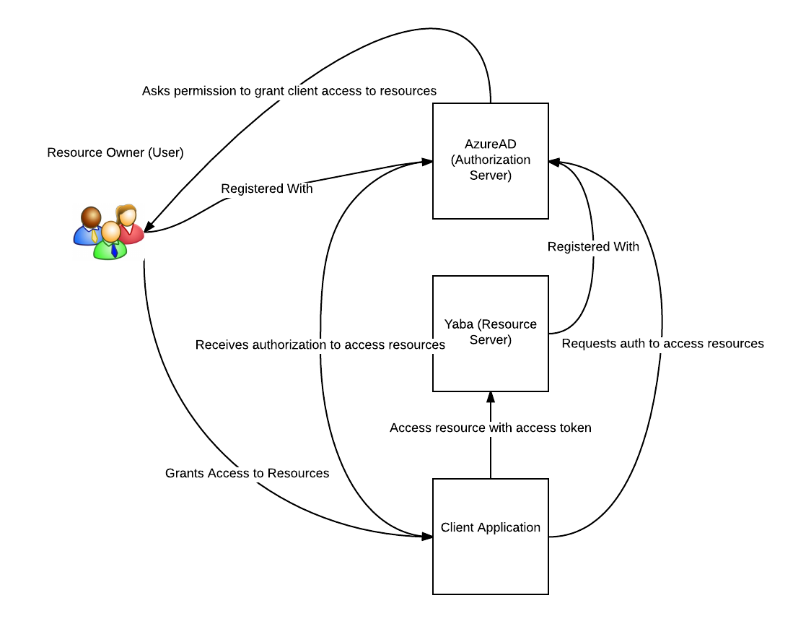
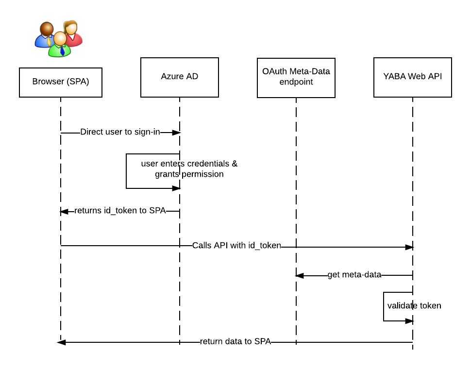

# YABA - Yet Another Blog App #
This is a simple React/Redux SPA application to demonstrate OAuth2 and OpenID Connect scenarios with Azure AD.  The blog app is based on Stephen Grider's fanstastic course on Udemy called [Modern React with Redux](https://www.udemy.com/react-redux/learn/v4/content); specifically his section on React Router. It is a fantastic intro course on React/Redux, I highly recommend.  In fact, I recommend all his courses if you want to ramp up on modern JS app development with React/Redux (which you should as it is part of our App stack!).  Here are the changes I made to integrate support for OpenID Connect and OAuth2 with Azure AD.

1. Implemented the blog API as a simple node app using express and Azure DocumentDB.  The create and delete posts APIs require an OAuth2 token.  The verification of the token is done using [passport](http://passportjs.org/) and [passport-azure-ad](https://github.com/AzureAD/passport-azure-ad) with provides both the OIDCStrategy and BearerStategy  to enforce access to the APIs.
2. Added the requirement to sign-in to add/delete a blog post; you can view blog posts without authentication.  The auth flow is OpenID Connect, which is an authentication layer above OAuth2.  I leverage the [ADAL JS library](https://github.com/AzureAD/azure-activedirectory-library-for-js) to handle all the low-level details of OpenID Connect and OAuth2.
3. Modified the organization of the code base to separate the client/API code.  
4. Upgraded to webpack 2.2.1 and modified the webpack.config.js to make it much more "production" appropriate with code-splitting, chunking, minifying etc.
5. Upgraded packages to work with more updated versions.  

## High Level Roles and Interactions ##

## OpenID Connect Implicit Flow ##

In this case, our application is a SPA app; the client directly accesses the APIs and hence needs access to the token.  In such a scenario, the 'implicit grant' flow should be used.  If the application was a standard web app with a server component that rendered the view to the browser, the 'authorized code grant' should be used.  With the 'authorized code grant', an authorization code is provided to the application.  The application exchanges the auth code for an access token.  This exchange is authenticated using a client_id and client_secret that is defined during application registration with the OAuth provider (e.g. Azure AD).  The access token is never exposed to the browser.  See [section 4.1](https://tools.ietf.org/html/rfc6749#section-4.1) of the OAuth 2.0 spec for 'Authorization Code Grant' flow.  See [section 4.2](https://tools.ietf.org/html/rfc6749#section-4.2) for the 'Implicit Grant' flow.

## Instructions to run the demo ##
1. Install node, npm
2. Install yarn, execute `npm install -g yarn` from your terminal.
3. Clone or download the project from [https://bitbucket.org/architech/azure-ad-authentication](https://bitbucket.org/architech/azure-ad-authentication)
4. Open a terminal, cd into the root directory and execute `yarn` to install all the dependencies
5. Register a 'Web App/API' application in Azure AD. See [here](https://docs.microsoft.com/en-us/azure/active-directory/develop/active-directory-integrating-applications) for instructions. For the 'sign-in' URL enter `http://localhost:8080`.  Add a 'Reply URL' and set it to `http://localhost:8080`.  Find the applicationID provided by Azure AD and copy it to the clipboard.
6. Open up the 'manifest' for your registered application in Azure AD.  Search for `oauth2AllowImplicitFlow` and set its value to true.
7. Update [config/default.json](./config/default.json) and update the 'appId' with the applicationID provided by Azure.  This the configuration for passport.js.  Passport needs to get the 'meta-data' for the Azure AD OpenID Connect endpoint in order to verify the JWT payload.  This verification is required to ensure the token passed to the API can be trusted.
8. Open up [config.js](./src/client/config.js) and update the clientID with your applicationID. ADAL needs this to ensure the authorization and id_token request is sent to the proper endpoint for our Azure AD tenant and application.
9. open a terminal, cd into the root directory of the application, execute `yarn start` to compile and start the app
10. Open chrome, open up dev tools, and navigate to `http://localhost:8080`

## Disclaimer ##
This is not production code! This is only to demonstrate using adal.js and passort to enable OpenID Connect authentication and OAuth2 authorization of APIs.

1. For React apps, you should think about how to apply auth rules to the routes that require authentication. The cleanest way is to implement a higher order component that wraps the Route components to layer in auth logic and integrate with adal.js.  This way, your application only depends on adal.js in one to two places.
2. The node app should factor out some logic into separate modules to be much cleaner.  Right now, everything is in the single server.js file.
3. There is zero error handling.  
4. I do not make use of any 'claims'.  The OpenID Connect id_token can contain arbitrary claims based on how you set up the roles in AD.  You can then provide attributes about a given identity as claims in the JWT payload.  Your application then can make authorization decisions based on those claims.
5. Zero performance considerations.  Nothing is cached and request to the OpenID metadata endpoint is performed on every API call.
6. Proper security.  The implicit flow sends the OpenID id_token and the OAuth access_token to the user-agent. In production, you MUST ensure that TLS is used to secure transporting the token.

## Tips & Tricks ##

1. Open up Chrome Dev Tools and have the network tab open as you login so you can see the requests to the auth endpoint and the token endpoint.
2. Install [Postman](https://www.getpostman.com/), a very helpful tool to send requests to APIs and understand the request/response.
3. Read the adal.js source code, starting with the 'login' method.  It is well authored and you will see what is required request and receive the OpenID Connect/OAuth2 tokens.

## References ##

1. [Azure AD OpenID Connect Example](https://docs.microsoft.com/en-us/azure/active-directory/develop/active-directory-protocols-openid-connect-code)
2. [Azure AD Authentication Scenarios](https://docs.microsoft.com/en-us/azure/active-directory/develop/active-directory-authentication-scenarios)
3. [Azure AD Developer Guide](https://docs.microsoft.com/en-ca/azure/active-directory/develop/active-directory-developers-guide)
4. [JWT Decoder](http://jwt.calebb.net/)
5. [Introducting ADAL.js](http://www.cloudidentity.com/blog/2015/02/19/introducing-adal-js-v1/)
6. [ADAL.js GitHub](https://github.com/AzureAD/azure-activedirectory-library-for-js)
7. [ADAL.js Stackoverflow](http://stackoverflow.com/questions/tagged/adal.js?sort=active)
8. [OAuth2 Implicit Grant Flow](https://docs.microsoft.com/en-us/azure/active-directory/develop/active-directory-dev-understanding-oauth2-implicit-grant)
9. [PassportJS Documentation](http://passportjs.org/docs)
10. [OpenID Connect Specs](http://openid.net/connect/)
11. [OAuth 2.0 Specs](https://tools.ietf.org/html/rfc6749)